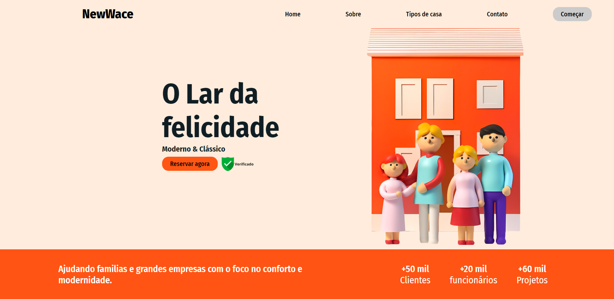
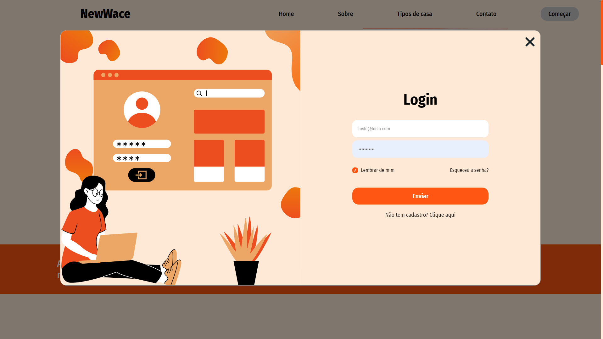
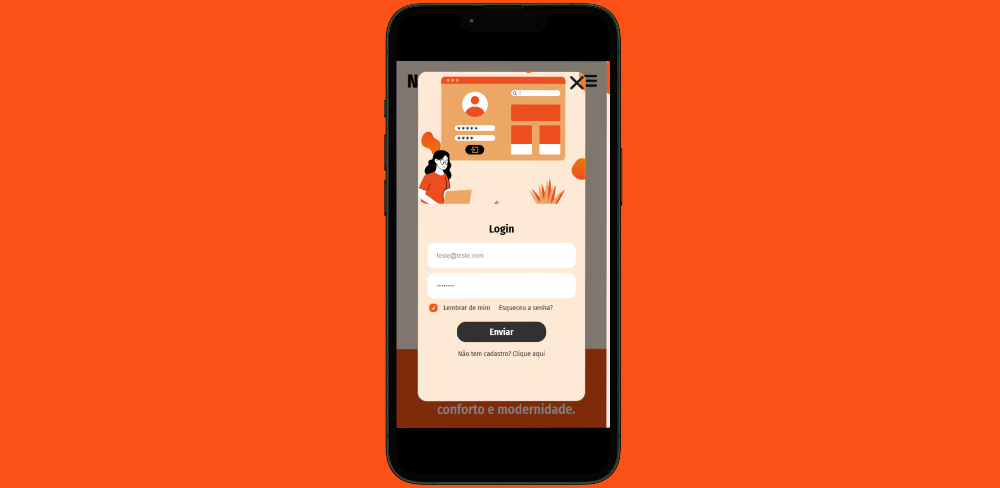

<h1>Projeto Website NewWace</h1>
  
Este projeto consiste em uma página inicial de um website chamado NewWace. O design é focado em uma estética moderna e limpa, com ênfase em elementos visuais atraentes e intuitivos.

  <h2>Estrutura do Projeto:</h2>
  <ul>
    <li><code>index.html</code>: Arquivo contendo a estrutura HTML da página inicial, incluindo o cabeçalho, navegação e seção principal.</li>
    <li><code>css/style.css</code>: Arquivo com as regras de estilo CSS aplicadas à página, incluindo layout, cores, tipografia e espaçamento.</li>
    <li><code>img/</code>: Diretório contendo as imagens utilizadas na página, incluindo o logotipo, ícones e imagens de fundo.</li>
    <li><code>404.html</code>: Arquivo HTML personalizado para página de erro 404, indicando que a página solicitada não foi encontrada.</li>
  </ul>

  <h2>Interface da Página Inicial Desktop</h2>
  
Abaixo está a imagem representando a interface da página inicial do projeto em dispositivos desktop:

  

  <h2>Interface da Página Inicial Mobile</h2>
  
Abaixo está a imagem representando a interface da página inicial do projeto em dispositivos mobile:

  

  <h2>Interface da Página de Login Desktop</h2>
  
Abaixo está a imagem representando a interface da página de login do projeto em dispositivos desktop:

  

  <h2>Interface da Página de Login Mobile</h2>
  
Abaixo está a imagem representando a interface da página de login do projeto em dispositivos mobile:

  

  <h2>Como Utilizar:</h2>
  
Este projeto consiste em um site completo para uma construtora de imóveis, contendo diversos conteúdos como menu, login, cadastro, reserva e inscrição para newsletter. Convido você a acessá-lo para explorar tudo o que desenvolvi para aprimorar meu aprendizado.
   Para visualizar este projeto localmente, siga estas etapas:

  <ol>
    <li>Clone este repositório em seu ambiente de desenvolvimento local:</li>
  </ol>
  <pre><code>git clone git@github.com:seu-usuario/Projeto-Website.git</code></pre>
  <ol start="2">
    <li>Abra o arquivo <code>index.html</code> em seu navegador web para visualizar a página inicial do website ou pode acessa-lo através do <b>GitHub Pages neste link: https://thalilaskaski.github.io/Projeto-Website/</li></b>
  </ol>

  <h2>Contribuindo:</h2>
  
Se você encontrar problemas ou tiver sugestões de melhorias, sinta-se à vontade para abrir uma issue ou enviar um pull request neste repositório. Sua contribuição é valorizada!

